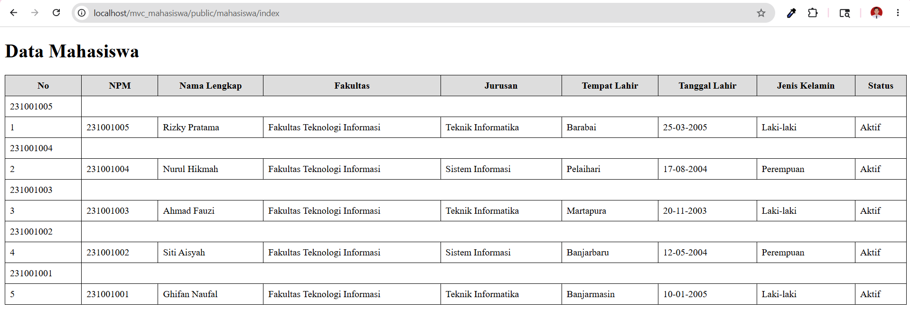
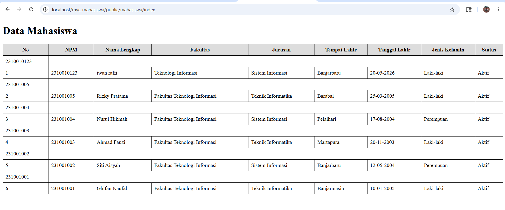
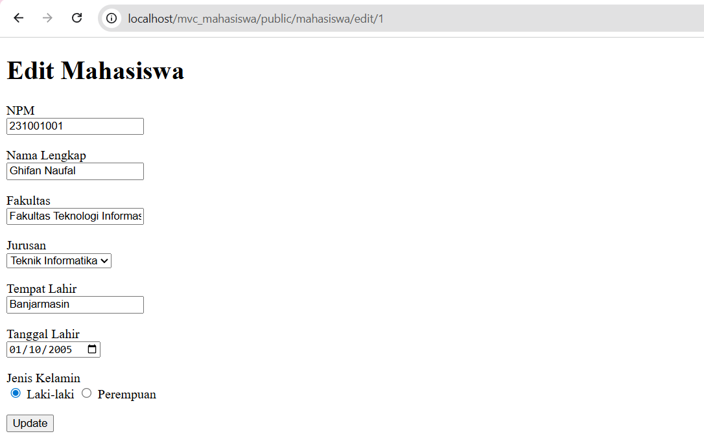
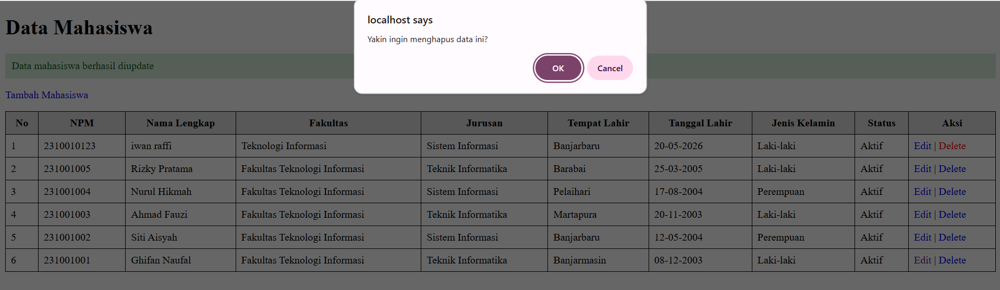
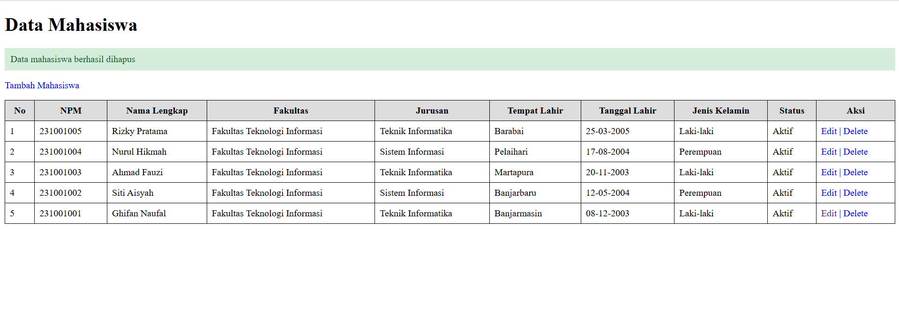
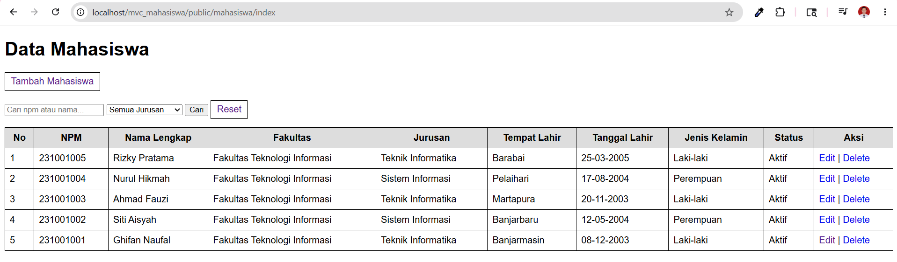
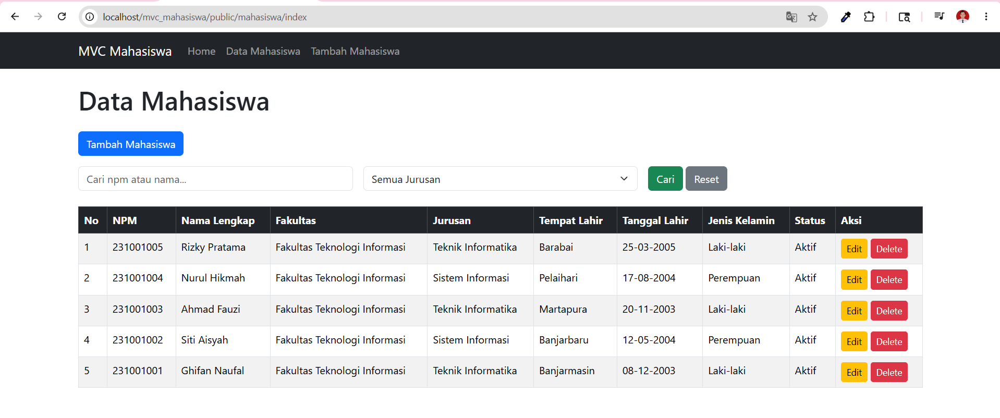
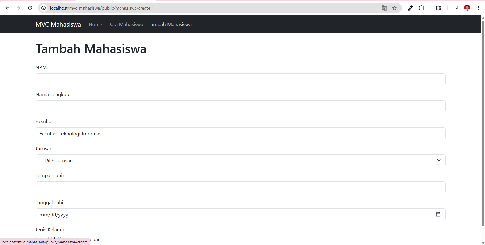
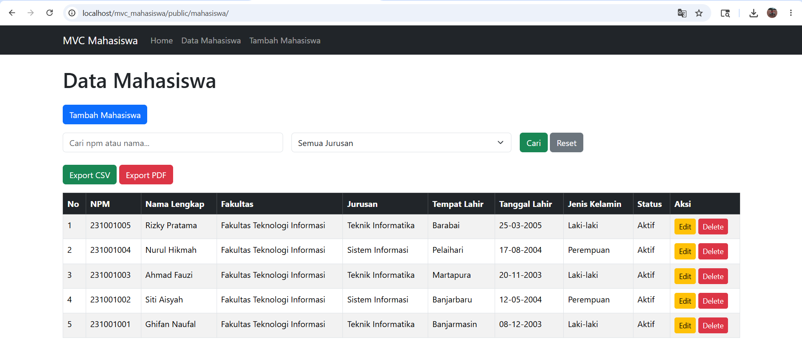
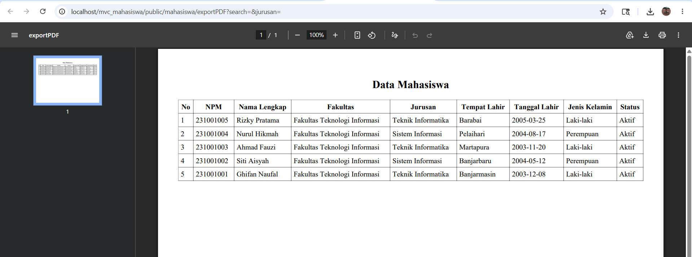

# Aplikasi MVC Mahasiswa

## Kelompok
- Ghifan Naufal Yoga Pratama - Muhammad Bayu Abdullah 1 - Backend
- Ghifan Naufal Yoga Pratama - Muhammad Bayu Abdullah 2 - Frontend
- Ghifan Naufal Yoga Pratama - Muhammad Bayu Abdullah 3 - Database

---

## Arsitektur MVC

Project menggunakan pola MVC:
- Model -> akses database
- View -> tampilan
- Controller -> logika aplikasi

---

## Cara Menjalankan

1. Import database:
   uniska_latihan_mvc_2026.sql

2. Jalankan XAMPP:
   - Apache
   - MySQL

3. Buka browser:
   http://localhost/mvc_mahasiswa/public

---

## Fitur

- CRUD Mahasiswa
- Search Data
- Filter Jurusan
- Export CSV
- Export PDF
- Bootstrap 5 Responsive

---

## Screenshot

Tambahkan screenshot setiap sesi.

## Sesi 1 - persiapan proyek

## Sesi 2 - Routing dan Base Controller

## SESI 3: MODEL, MIGRASI DUMMY DATA, DAN MENAMPILKAN DATA MAHASISWA

## SESI 4: TAMBAH DATA MAHASISWA (CREATE)

## SESI 5: EDIT DAN HAPUS DATA (UPDATE & DELETE)

## SESI 6: PENCARIAN DAN FILTER DATA 

## SESI 7: LAYOUT DENGAN BOOTSTRAP & RESPONSIVITAS 

## SESI 8: FINAL PROJECT – EXPORT DATA KE PDF/EXCEL & DOKUMENTASI 

## Repository

https://github.com/MhmmdBayuAbdullah/mvc_mahasiswa